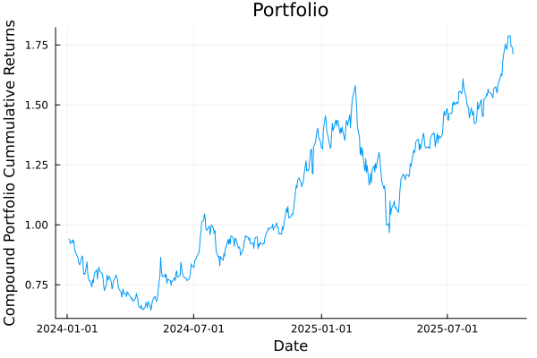
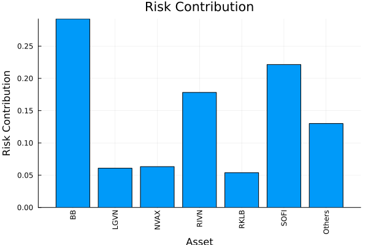
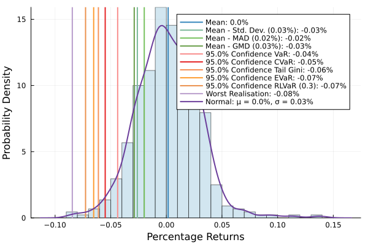
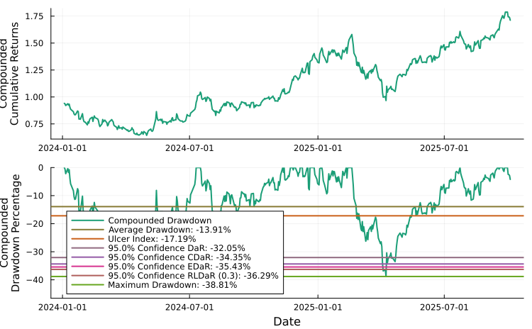

# PortfolioOptimisers.jl

[](https://dcelisgarza.github.io/PortfolioOptimisers.jl/stable)
[](https://dcelisgarza.github.io/PortfolioOptimisers.jl/dev)
[](https://github.com/dcelisgarza/PortfolioOptimisers.jl/actions/workflows/Test.yml?query=branch%3Amain)
[](https://codecov.io/gh/dcelisgarza/PortfolioOptimisers.jl)
[](https://github.com/dcelisgarza/PortfolioOptimisers.jl/actions/workflows/Docs.yml?query=branch%3Amain)
[](https://cirrus-ci.com/github/dcelisgarza/PortfolioOptimisers.jl)
[](https://doi.org/FIXME)
[](CODE_OF_CONDUCT.md)
[](#contributors)
[](https://github.com/JuliaBesties/BestieTemplate.jl)
[](https://github.com/JuliaTesting/Aqua.jl)

## Welcome to PortfolioOptimisers.jl

 [`PortfolioOptimisers.jl`](https://github.com/dcelisgarza/PortfolioOptimisers.jl) is a package for portfolio optimisation written in Julia.

> [!CAUTION]
> Investing conveys real risk, the entire point of portfolio optimisation is to minimise it to tolerable levels. The examples use outdated data and a variety of stocks (including what I consider to be meme stocks) for demonstration purposes only. None of the information in this documentation should be taken as financial advice. Any advice is limited to improving portfolio construction, most of which is common investment and statistical knowledge.

Portfolio optimisation is the science of either:

- Minimising risk whilst keeping returns to acceptable levels.
- Maximising returns whilst keeping risk to acceptable levels.

To some definition of acceptable, and with any number of additional constraints available to the optimisation type.

There exist myriad statistical, pre- and post-processing, optimisations, and constraints that allow one to explore a vast landscape of "optimal" portfolios.

`PortfolioOptimisers.jl` is an attempt at providing as many of these as possible under a single banner. We make extensive use of `Julia`'s type system, module extensions, and multiple dispatch to simplify development and maintenance.

For more information on the package's *vast* feature list, please check out the [examples](https://dcelisgarza.github.io/PortfolioOptimisers.jl/stable/examples/00_Examples_Introduction) and [API](https://dcelisgarza.github.io/PortfolioOptimisers.jl/stable/api/00_API_Introduction) docs.

## Caveat emptor

- `PortfolioOptimisers.jl` is under active development and still in `v0.*.*`. Therefore, breaking changes should be expected with `v0.X.0` releases. All other releases will fall under `v0.X.Y`.
- The documentation is still under construction.
- Testing coverage is still under `95 %`. We're mainly missing assertion tests, but some lesser used features are partially or wholly untested.
- Please feel free to submit issues, discussions and/or PRs regarding missing docs, examples, features, tests, and bugs.

## Installation

`PortfolioOptimisers.jl` is a registered package, so installation is as simple as:

```julia
julia> using Pkg

julia> Pkg.add(PackageSpec(; name = "PortfolioOptimisers"))
```

## Quick-start

The library is quite powerful and extremely flexible. Here is what a very basic end-to-end workflow can look like. The [examples](https://dcelisgarza.github.io/PortfolioOptimisers.jl/stable/examples/00_Examples_Introduction) contain more thorough explanations and demos. The [API](https://dcelisgarza.github.io/PortfolioOptimisers.jl/stable/api/00_API_Introduction) docs contain toy examples of the many, many features.

First we import the packages we will need for the example.

- `StatsPlots` and `GraphRecipes` are needed to load the `Plots.jl` extension.
- `Clarabel` and `HiGHS` are the optimisers we will use.
- `YFinance` and `TimeSeries` for downloading and preprocessing price data.
- `PrettyTables` and `DataFrames` for displaying the results.

```julia
# Import module and plotting extension.
using PortfolioOptimisers, StatsPlots, GraphRecipes
# Import optimisers.
using Clarabel, HiGHS
# Download data and pretty printing
using YFinance, PrettyTables, TimeSeries, DataFrames

# Format for pretty tables.
fmt1 = (v, i, j) -> begin
    if j == 1
        return Date(v)
    else
        return v
    end
end

fmt2 = (v, i, j) -> begin
    if j ∈ (1, 2, 3)
        return v
    else
        return isa(v, Number) ? "$(round(v*100, digits=3)) %" : v
    end
end

# Function to convert prices to time array.
function stock_price_to_time_array(x)
    # Only get the keys that are not ticker or datetime.
    coln = collect(keys(x))[3:end]
    # Convert the dictionary into a matrix.
    m = hcat([x[k] for k in coln]...)
    return TimeArray(x["timestamp"], m, Symbol.(coln), x["ticker"])
end

# Tickers to download. These are popular meme stocks, use something better.
assets = sort!(["SOUN", "RIVN", "GME", "AMC", "SOFI", "ENVX", "ANVS", "LUNR", "EOSE", "SMR",
                "NVAX", "UPST", "ACHR", "RKLB", "MARA", "LGVN", "LCID", "CHPT", "MAXN",
                "BB"])

# Prices date range.
Date_0 = "2024-01-01"
Date_1 = "2025-10-05"

# Download the price data using YFinance.
prices = get_prices.(assets; startdt = Date_0, enddt = Date_1)
prices = stock_price_to_time_array.(prices)
prices = hcat(prices...)
cidx = colnames(prices)[occursin.(r"adj", string.(colnames(prices)))]
prices = prices[cidx]
TimeSeries.rename!(prices, Symbol.(assets))
pretty_table(prices[(end - 5):end]; formatters = [fmt1])
#=
┌────────────┬─────────┬─────────┬─────────┬─────────┬─────────┬─────────┬─────────┬─────────┬─────────┬─────────┬─────────┬─────────┬─────────┬─────────┬─────────┬─────────┬─────────┬─────────┬─────────┬─────────┐
│  timestamp │    ACHR │     AMC │    ANVS │      BB │    CHPT │    ENVX │    EOSE │     GME │    LCID │    LGVN │    LUNR │    MARA │    MAXN │    NVAX │    RIVN │    RKLB │     SMR │    SOFI │    SOUN │    UPST │
│   DateTime │ Float64 │ Float64 │ Float64 │ Float64 │ Float64 │ Float64 │ Float64 │ Float64 │ Float64 │ Float64 │ Float64 │ Float64 │ Float64 │ Float64 │ Float64 │ Float64 │ Float64 │ Float64 │ Float64 │ Float64 │
├────────────┼─────────┼─────────┼─────────┼─────────┼─────────┼─────────┼─────────┼─────────┼─────────┼─────────┼─────────┼─────────┼─────────┼─────────┼─────────┼─────────┼─────────┼─────────┼─────────┼─────────┤
│ 2025-09-26 │    9.28 │    2.89 │    1.97 │    4.96 │   10.84 │   10.09 │   10.12 │   26.42 │   23.96 │   0.799 │   10.08 │   16.13 │    3.53 │    8.55 │   15.59 │   46.26 │    38.0 │   27.98 │   15.94 │   57.35 │
│ 2025-09-29 │    9.65 │     3.0 │    2.04 │     5.0 │   11.05 │    9.97 │   11.17 │   27.21 │   24.11 │    0.77 │   10.26 │   18.66 │    3.55 │    8.57 │   15.25 │   47.01 │   38.16 │   27.55 │   15.68 │   52.74 │
│ 2025-09-30 │    9.58 │     2.9 │    2.07 │    4.88 │   10.92 │    9.97 │   11.39 │   27.28 │   23.79 │    0.75 │   10.52 │   18.26 │    3.35 │    8.67 │   14.68 │   47.91 │    36.0 │   26.42 │   16.08 │    50.8 │
│ 2025-10-01 │    9.81 │    2.95 │    2.13 │    4.79 │   11.63 │   11.11 │   12.37 │   27.69 │  24.295 │   0.742 │   10.61 │   18.61 │    3.58 │     9.5 │   14.61 │   47.97 │   36.61 │   25.76 │   16.15 │   52.13 │
│ 2025-10-02 │   10.18 │    3.15 │    2.23 │    4.75 │   11.32 │   11.65 │   12.36 │   27.22 │    24.1 │   0.765 │   11.22 │   18.79 │    3.78 │    9.55 │   13.53 │   52.47 │   39.51 │   25.97 │   17.84 │   52.88 │
│ 2025-10-03 │   11.57 │    3.06 │    2.22 │     4.5 │   11.94 │   11.92 │    12.6 │   25.38 │   24.77 │   0.788 │   11.44 │   18.82 │     3.6 │    9.46 │   13.65 │   56.16 │   40.12 │   25.24 │   17.85 │   51.96 │
└────────────┴─────────┴─────────┴─────────┴─────────┴─────────┴─────────┴─────────┴─────────┴─────────┴─────────┴─────────┴─────────┴─────────┴─────────┴─────────┴─────────┴─────────┴─────────┴─────────┴─────────┘
=#

# Compute the returns.
rd = prices_to_returns(prices)
#=
ReturnsResult
    nx ┼ 20-element Vector{String}
     X ┼ 440×20 Matrix{Float64}
    nf ┼ nothing
     F ┼ nothing
    ts ┼ 440-element Vector{DateTime}
    iv ┼ nothing
  ivpa ┴ nothing
=#

# Define the continuous solver.
slv = Solver(; name = :clarabel1, solver = Clarabel.Optimizer,
             settings = Dict("verbose" => false, "max_step_fraction" => 0.9),
             check_sol = (; allow_local = true, allow_almost = true))
#=
Solver
         name ┼ Symbol: :clarabel1
       solver ┼ UnionAll: Clarabel.MOIwrapper.Optimizer
     settings ┼ Dict{String, Real}: Dict{String, Real}("verbose" => false, "max_step_fraction" => 0.9)
    check_sol ┼ @NamedTuple{allow_local::Bool, allow_almost::Bool}: (allow_local = true, allow_almost = true)
  add_bridges ┴ Bool: true
=#

# `PortfolioOptimisers.jl` implements a number of optimisation types as estimators. All the ones which use mathematical optimisation require a `JuMPOptimiser` structure which defines general solver constraints. This structure in turn requires an instance (or vector) of `Solver`.
opt = JuMPOptimiser(; slv = slv);

# Vanilla (Markowitz) mean risk optimisation, i.e. minimum variance portfolio
mr = MeanRisk(; opt = opt)
#=
MeanRisk
  opt ┼ JuMPOptimiser
      │       pr ┼ EmpiricalPrior
      │          │        ce ┼ PortfolioOptimisersCovariance
      │          │           │   ce ┼ Covariance
      │          │           │      │    me ┼ SimpleExpectedReturns
      │          │           │      │       │   w ┴ nothing
      │          │           │      │    ce ┼ GeneralCovariance
      │          │           │      │       │   ce ┼ StatsBase.SimpleCovariance: StatsBase.SimpleCovariance(true)
      │          │           │      │       │    w ┴ nothing
      │          │           │      │   alg ┴ Full()
      │          │           │   mp ┼ DenoiseDetoneAlgMatrixProcessing
      │          │           │      │     pdm ┼ Posdef
      │          │           │      │         │      alg ┼ UnionAll: NearestCorrelationMatrix.Newton
      │          │           │      │         │   kwargs ┴ @NamedTuple{}: NamedTuple()
      │          │           │      │      dn ┼ nothing
      │          │           │      │      dt ┼ nothing
      │          │           │      │     alg ┼ nothing
      │          │           │      │   order ┴ DenoiseDetoneAlg()
      │          │        me ┼ SimpleExpectedReturns
      │          │           │   w ┴ nothing
      │          │   horizon ┴ nothing
      │      slv ┼ Solver
      │          │          name ┼ Symbol: :clarabel1
      │          │        solver ┼ UnionAll: Clarabel.MOIwrapper.Optimizer
      │          │      settings ┼ Dict{String, Real}: Dict{String, Real}("verbose" => false, "max_step_fraction" => 0.9)
      │          │     check_sol ┼ @NamedTuple{allow_local::Bool, allow_almost::Bool}: (allow_local = true, allow_almost = true)
      │          │   add_bridges ┴ Bool: true
      │       wb ┼ WeightBounds
      │          │   lb ┼ Float64: 0.0
      │          │   ub ┴ Float64: 1.0
      │      bgt ┼ Float64: 1.0
      │     sbgt ┼ nothing
      │       lt ┼ nothing
      │       st ┼ nothing
      │      lcs ┼ nothing
      │       ct ┼ nothing
      │    gcard ┼ nothing
      │   sgcard ┼ nothing
      │     smtx ┼ nothing
      │    sgmtx ┼ nothing
      │      slt ┼ nothing
      │      sst ┼ nothing
      │     sglt ┼ nothing
      │     sgst ┼ nothing
      │       tn ┼ nothing
      │     fees ┼ nothing
      │     sets ┼ nothing
      │       tr ┼ nothing
      │       pl ┼ nothing
      │      ret ┼ ArithmeticReturn
      │          │   ucs ┼ nothing
      │          │    lb ┼ nothing
      │          │    mu ┴ nothing
      │      sca ┼ SumScalariser()
      │     ccnt ┼ nothing
      │     cobj ┼ nothing
      │       sc ┼ Int64: 1
      │       so ┼ Int64: 1
      │       ss ┼ nothing
      │     card ┼ nothing
      │    scard ┼ nothing
      │      nea ┼ nothing
      │       l1 ┼ nothing
      │       l2 ┼ nothing
      │   strict ┴ Bool: false
    r ┼ Variance
      │   settings ┼ RiskMeasureSettings
      │            │   scale ┼ Float64: 1.0
      │            │      ub ┼ nothing
      │            │     rke ┴ Bool: true
      │      sigma ┼ nothing
      │       chol ┼ nothing
      │         rc ┼ nothing
      │        alg ┴ SquaredSOCRiskExpr()
  obj ┼ MinimumRisk()
   wi ┼ nothing
   fb ┴ nothing
=#

# Perform the optimisation, res.w contains the optimal weights.
res = optimise(mr, rd)
#=
MeanRiskResult
       oe ┼ DataType: DataType
       pa ┼ ProcessedJuMPOptimiserAttributes
          │       pr ┼ LowOrderPrior
          │          │         X ┼ 440×20 Matrix{Float64}
          │          │        mu ┼ 20-element Vector{Float64}
          │          │     sigma ┼ 20×20 Matrix{Float64}
          │          │      chol ┼ nothing
          │          │         w ┼ nothing
          │          │       ens ┼ nothing
          │          │       kld ┼ nothing
          │          │        ow ┼ nothing
          │          │        rr ┼ nothing
          │          │      f_mu ┼ nothing
          │          │   f_sigma ┼ nothing
          │          │       f_w ┴ nothing
          │       wb ┼ WeightBounds
          │          │   lb ┼ 20-element StepRangeLen{Float64, Base.TwicePrecision{Float64}, Base.TwicePrecision{Float64}, Int64}
          │          │   ub ┴ 20-element StepRangeLen{Float64, Base.TwicePrecision{Float64}, Base.TwicePrecision{Float64}, Int64}
          │       lt ┼ nothing
          │       st ┼ nothing
          │      lcs ┼ nothing
          │       ct ┼ nothing
          │    gcard ┼ nothing
          │   sgcard ┼ nothing
          │     smtx ┼ nothing
          │    sgmtx ┼ nothing
          │      slt ┼ nothing
          │      sst ┼ nothing
          │     sglt ┼ nothing
          │     sgst ┼ nothing
          │       tn ┼ nothing
          │     fees ┼ nothing
          │       pl ┼ nothing
          │      ret ┼ ArithmeticReturn
          │          │   ucs ┼ nothing
          │          │    lb ┼ nothing
          │          │    mu ┴ nothing
  retcode ┼ OptimisationSuccess
          │   res ┴ Dict{Any, Any}: Dict{Any, Any}()
      sol ┼ JuMPOptimisationSolution
          │   w ┴ 20-element Vector{Float64}
    model ┼ A JuMP Model
          │ ├ solver: Clarabel
          │ ├ objective_sense: MIN_SENSE
          │ │ └ objective_function_type: JuMP.QuadExpr
          │ ├ num_variables: 21
          │ ├ num_constraints: 4
          │ │ ├ JuMP.AffExpr in MOI.EqualTo{Float64}: 1
          │ │ ├ Vector{JuMP.AffExpr} in MOI.Nonnegatives: 1
          │ │ ├ Vector{JuMP.AffExpr} in MOI.Nonpositives: 1
          │ │ └ Vector{JuMP.AffExpr} in MOI.SecondOrderCone: 1
          │ └ Names registered in the model
          │   └ :G, :bgt, :dev_1, :dev_1_soc, :k, :lw, :obj_expr, :ret, :risk, :risk_vec, :sc, :so, :variance_flag, :variance_risk_1, :w, :w_lb, :w_ub
       fb ┴ nothing
=#

# Define the MIP solver for finite discrete allocation.
mip_slv = Solver(; name = :highs1, solver = HiGHS.Optimizer,
                 settings = Dict("log_to_console" => false),
                 check_sol = (; allow_local = true, allow_almost = true));

# Discrete finite allocation.
da = DiscreteAllocation(; slv = mip_slv)
#=
DiscreteAllocation
  slv ┼ Solver
      │          name ┼ Symbol: :highs1
      │        solver ┼ DataType: DataType
      │      settings ┼ Dict{String, Bool}: Dict{String, Bool}("log_to_console" => 0)
      │     check_sol ┼ @NamedTuple{allow_local::Bool, allow_almost::Bool}: (allow_local = true, allow_almost = true)
      │   add_bridges ┴ Bool: true
   sc ┼ Int64: 1
   so ┼ Int64: 1
   wf ┼ AbsoluteErrorWeightFinaliser()
   fb ┼ GreedyAllocation
      │     unit ┼ Int64: 1
      │     args ┼ Tuple{}: ()
      │   kwargs ┼ @NamedTuple{}: NamedTuple()
      │       fb ┴ nothing
=#

# Perform the finite discrete allocation, uses the final asset
# prices, and an available cash amount. This is for us mortals
# without infinite wealth.
mip_res = optimise(da, res.w, vec(values(prices[end])), 4206.90)
#=
DiscreteAllocationResult
         oe ┼ DataType: DataType
    retcode ┼ OptimisationSuccess
            │   res ┴ nothing
  s_retcode ┼ nothing
  l_retcode ┼ OptimisationSuccess
            │   res ┴ Dict{Any, Any}: Dict{Any, Any}()
     shares ┼ 20-element SubArray{Float64, 1, Matrix{Float64}, Tuple{Base.Slice{Base.OneTo{Int64}}, Int64}, true}
       cost ┼ 20-element SubArray{Float64, 1, Matrix{Float64}, Tuple{Base.Slice{Base.OneTo{Int64}}, Int64}, true}
          w ┼ 20-element SubArray{Float64, 1, Matrix{Float64}, Tuple{Base.Slice{Base.OneTo{Int64}}, Int64}, true}
       cash ┼ Float64: 0.2000379800783776
    s_model ┼ nothing
    l_model ┼ A JuMP Model
            │ ├ solver: HiGHS
            │ ├ objective_sense: MIN_SENSE
            │ │ └ objective_function_type: JuMP.AffExpr
            │ ├ num_variables: 21
            │ ├ num_constraints: 42
            │ │ ├ JuMP.AffExpr in MOI.GreaterThan{Float64}: 1
            │ │ ├ Vector{JuMP.AffExpr} in MOI.NormOneCone: 1
            │ │ ├ JuMP.VariableRef in MOI.GreaterThan{Float64}: 20
            │ │ └ JuMP.VariableRef in MOI.Integer: 20
            │ └ Names registered in the model
            │   └ :r, :sc, :so, :u, :x
         fb ┴ nothing
=#

# View the results.
df = DataFrame(:assets => rd.nx, :shares => mip_res.shares, :cost => mip_res.cost,
               :opt_weights => res.w, :mip_weights => mip_res.w)
pretty_table(df; formatters = [fmt2])
#=
┌────────┬─────────┬─────────┬─────────────┬─────────────┐
│ assets │  shares │    cost │ opt_weights │ mip_weights │
│ String │ Float64 │ Float64 │     Float64 │     Float64 │
├────────┼─────────┼─────────┼─────────────┼─────────────┤
│   ACHR │     0.0 │     0.0 │       0.0 % │       0.0 % │
│    AMC │    73.0 │  223.38 │     5.324 % │      5.31 % │
│   ANVS │    22.0 │   48.84 │     1.249 % │     1.161 % │
│     BB │   273.0 │  1228.5 │    29.184 % │    29.203 % │
│   CHPT │    11.0 │  131.34 │     3.002 % │     3.122 % │
│   ENVX │     0.0 │     0.0 │       0.0 % │       0.0 % │
│   EOSE │     8.0 │   100.8 │     2.435 % │     2.396 % │
│    GME │     0.0 │     0.0 │       0.0 % │       0.0 % │
│   LCID │     1.0 │   24.77 │     0.638 % │     0.589 % │
│   LGVN │   325.0 │   256.1 │     6.089 % │     6.088 % │
│   LUNR │     0.0 │     0.0 │       0.0 % │       0.0 % │
│   MARA │     1.0 │   18.82 │     0.613 % │     0.447 % │
│   MAXN │     0.0 │     0.0 │       0.0 % │       0.0 % │
│   NVAX │    28.0 │  264.88 │      6.21 % │     6.297 % │
│   RIVN │    55.0 │  750.75 │    17.897 % │    17.847 % │
│   RKLB │     4.0 │  224.64 │     4.896 % │      5.34 % │
│    SMR │     0.0 │     0.0 │       0.0 % │       0.0 % │
│   SOFI │    37.0 │  933.88 │    22.462 % │      22.2 % │
│   SOUN │     0.0 │     0.0 │       0.0 % │       0.0 % │
│   UPST │     0.0 │     0.0 │       0.0 % │       0.0 % │
└────────┴─────────┴─────────┴─────────────┴─────────────┘
=#

# Plot the portfolio cumulative returns of the finite allocation portfolio.
plot_ptf_cumulative_returns(mip_res.w, rd.X; ts = rd.ts, compound = true)
```



```julia
# Furthermore, we can also plot the risk contribution per asset. For this, we must provide an instance of the risk measure we want to use with the appropriate statistics/parameters. We can do this by using the `factory` function (recommended when doing so programmatically), or manually set the quantities ourselves.
plot_risk_contribution(factory(Variance(), res.pr), mip_res.w, rd.X; nx = rd.nx,
                       percentage = true)

# This awkwardness is due to the fact that `PortfolioOptimisers.jl` tries to decouple the risk measures from optimisation estimators and results. However, the advantage of this approach is that it lets us use multiple different risk measures as part of the risk expression, or as risk limits in optimisations. We explore this further in the [examples](https://dcelisgarza.github.io/PortfolioOptimisers.jl/stable/examples/00_Examples_Introduction).
```



```julia
# We can also plot the returns' histogram and probability density.
plot_histogram(mip_res.w, rd.X, slv)
```



```julia
# Plot compounded or uncompounded drawdowns. We use the former here.
plot_drawdowns(mip_res.w, rd.X, slv; ts = rd.ts, compound = true)
```



There are other kinds of plots which we explore in the [examples](https://dcelisgarza.github.io/PortfolioOptimisers.jl/stable/examples/00_Examples_Introduction).

## Features

This section is under active development and any [`<name>`]-(TBA) lack docstrings. Some docstrings are also outdated, please refer to [Issue #58](https://github.com/dcelisgarza/PortfolioOptimisers.jl/issues/58) for details on what docstrings have been completed in the `dev` branch.

### Preprocessing

- Prices to returns [`prices_to_returns`](@ref) and [`ReturnsResult`](@ref)
- Find complete indices [`find_complete_indices`](@ref)
- Find uncorrelated indices [`find_uncorrelated_indices`]-(@ref)

### Matrix processing

- Positive definite projection [`Posdef`](@ref), [`posdef!`](@ref), [`posdef`](@ref)
- <details><summary>Denoising [`Denoise`](@ref), [`denoise!`](@ref), [`denoise`](@ref)</summary>
  
  - Spectral [`SpectralDenoise`](@ref)
  - Fixed [`FixedDenoise`](@ref)
  - Shrunk [`ShrunkDenoise`](@ref)

  </details>
- Detoning [`Detone`](@ref), [`detone!`](@ref), [`detone`](@ref)
- Matrix processing pipeline [`DenoiseDetoneAlgMatrixProcessing`](@ref), [`matrix_processing!`](@ref), [`matrix_processing`](@ref), [`DenoiseDetoneAlg`](@ref), [`DenoiseAlgDetone`](@ref), [`DetoneDenoiseAlg`](@ref), [`DetoneAlgDenoise`](@ref), [`AlgDenoiseDetone`](@ref), [`AlgDetoneDenoise`](@ref)

### Regression models

Factor prior models and implied volatility use [`regression`](@ref) in their estimation, which return a [`Regression`](@ref) object.

#### Regression targets

- Linear model [`LinearModel`](@ref)
- Generalised linear model [`GeneralisedLinearModel`](@ref)

#### Regression types

- <details><summary>Stepwise [`StepwiseRegression`](@ref)</summary>
  - <details><summary>Algorithms</summary>
    - Forward [`Forward`](@ref)
    - Backward [`Backward`](@ref)
    </details>
  - <details><summary>Selection criteria</summary>
    - P-value [`PValue`](@ref)
    - Akaike information criteria [`AIC`](@ref)
    - Corrected Akaike information criteria [`AICC`](@ref)
    - Bayesian information criteria [`BIC`](@ref)
    - R-squared [`RSquared`](@ref)
    - Adjusted R-squared criteria [`AdjustedRSquared`](@ref)
    </details>
  </details>
- <details><summary>Dimensional reduction with custom mean and variance estimators [`DimensionReductionRegression`](@ref)</summary>
  - Principal component [`PCA`](@ref)
  - Probabilistic principal component [`PPCA`](@ref)
  </details>

### Moment estimation

#### Expected returns

Overloads `Statistics.mean`.

- Optionally weighted expected returns [`SimpleExpectedReturns`](@ref)
- Equilibrium expected returns with custom covariance [`EquilibriumExpectedReturns`](@ref)
- Excess expected returns with custom expected returns estimator [`ExcessExpectedReturns`](@ref)
- <details><summary>Shrunk expected returns with custom expected returns and custom covariance estimators [`ShrunkExpectedReturns`](@ref)</summary>
  - <details><summary>Algorithms</summary>
    - James-Stein [`JamesStein`](@ref)
    - Bayes-Stein [`BayesStein`](@ref)
    - Bodnar-Okhrin-Parolya [`BodnarOkhrinParolya`](@ref)
  - <details><summary>Targets: all algorithms can have any of the following targets</summary>
    - Grand Mean [`GrandMean`](@ref)
    - Volatility Weighted [`VolatilityWeighted`](@ref)
    - Mean Squared Error [`MeanSquaredError`](@ref)
- Standard deviation expected returns [`StandardDeviationExpectedReturns`]-(@ref)

#### Variance and standard deviation

Overloads `Statistics.var` and `Statistics.std`.

- Optionally weighted variance with custom expected returns estimator [`SimpleVariance`](@ref)

#### Covariance and correlation

Overloads `Statistics.cov` and `Statistics.cor`.

- Optionally weighted covariance with custom covariance estimator [`GeneralCovariance`](@ref)
- <details><summary>Covariance with custom covariance estimator [`Covariance`](@ref)</summary>
  - Full [`Full`](@ref)
  - Semi [`Semi`](@ref)
- <details><summary>Gerber covariances with custom variance estimator [`GerberCovariance`](@ref)</summary>
  - <details><summary>Unstandardised algorithms</summary>
    - Gerber 0 [`Gerber0`](@ref)
    - Gerber 1 [`Gerber1`](@ref)
    - Gerber 2 [`Gerber2`](@ref)
  - <details><summary>Standardised algorithms (Z-transforms the data beforehand) with custom expected returns estimator</summary>
    - Gerber 0 [`StandardisedGerber0`](@ref)
    - Gerber 1 [`StandardisedGerber1`](@ref)
    - Gerber 2 [`StandardisedGerber2`](@ref)
- <details><summary>Smyth-Broby extension of Gerber covariances with custom expected returns and variance estimators [`SmythBrobyCovariance`](@ref)</summary>
  - <details><summary>Unstandardised algorithms</summary>
    - Smyth-Broby 0 [`SmythBroby0`](@ref)
    - Smyth-Broby 1 [`SmythBroby1`](@ref)
    - Smyth-Broby 2 [`SmythBroby2`](@ref)
    - Smyth-Broby-Gerber 0 [`SmythBrobyGerber0`](@ref)
    - Smyth-Broby-Gerber 1 [`SmythBrobyGerber1`](@ref)
    - Smyth-Broby-Gerber 2 [`SmythBrobyGerber2`](@ref)
  - <details><summary>Standardised algorithms (Z-transforms the data beforehand)</summary>
    - Smyth-Broby 0 [`StandardisedSmythBroby0`](@ref)
    - Smyth-Broby 1 [`StandardisedSmythBroby1`](@ref)
    - Smyth-Broby 2 [`StandardisedSmythBroby2`](@ref)
    - Smyth-Broby-Gerber 0 [`StandardisedSmythBrobyGerber0`](@ref)
    - Smyth-Broby-Gerber 1 [`StandardisedSmythBrobyGerber1`](@ref)
    - Smyth-Broby-Gerber 2 [`StandardisedSmythBrobyGerber2`](@ref)
- Distance covariance with custom distance estimator via [`Distances.jl`](https://github.com/JuliaStats/Distances.jl) [`DistanceCovariance`](@ref)
- Lower Tail Dependence covariance [`LowerTailDependenceCovariance`](@ref)
- <details><summary>Rank covariances</summary>
  - Kendall covariance [`KendallCovariance`](@ref)
  - Spearman covariance [`SpearmanCovariance`](@ref)
- <details><summary>Mutual information covariance with custom variance estimator and various binning algorithms [`MutualInfoCovariance`](@ref)</summary>
  - <details><summary>[`AstroPy`](https://docs.astropy.org/en/stable/stats/ref_api.html)-defined bins</summary>
    - Knuth's optimal bin width [`Knuth`](@ref)
    - Freedman Diaconis bin width [`FreedmanDiaconis`](@ref)
    - Scott's bin width [`Scott`](@ref)
  - Hacine-Gharbi-Ravier bin width [`HacineGharbiRavier`](@ref)
  - Predefined number of bins
- Denoised covariance with custom covariance estimator [`DenoiseCovariance`](@ref)
- Detoned covariance with custom covariance estimator [`DetoneCovariance`](@ref)
- Custom processed covariance with custom covariance estimator [`ProcessedCovariance`](@ref)
- <details><summary>Implied volatility with custom covariance and matrix processing estimators, and implied volatility algorithms [`ImpliedVolatility`]-(@ref)</summary>
  - Premium [`ImpliedVolatilityPremium`]-(@ref)
  - Regression [`ImpliedVolatilityRegression`]-(@ref)
- Covariance with custom covariance estimator and matrix processing pipeline [`PortfolioOptimisersCovariance`](@ref)
- Correlation covariance [`CorrelationCovariance`]-(@ref)

#### Coskewness

Implements [`coskewness`](@ref).

- <details><summary>Coskewness and spectral decomposition of the negative coskewness with custom expected returns estimator and matrix processing pipeline [`Coskewness`](@ref)</summary>
  - Full [`Full`](@ref)
  - Semi [`Semi`](@ref)

#### Cokurtosis

Implements [`cokurtosis`](@ref).

- <details><summary>Cokurtosis with custom expected returns estimator and matrix processing pipeline [`Cokurtosis`](@ref)</summary>
  - Full [`Full`](@ref)
  - Semi [`Semi`](@ref)

### Distance matrices

Implements [`distance`](@ref) and [`cor_and_dist`](@ref).

- First order distance estimator with custom distance algorithm, and optional exponent [`Distance`](@ref)
- Second order distance estimator with custom pairwise distance algorithm from [`Distances.jl`](https://github.com/JuliaStats/Distances.jl), custom distance algorithm, and optional exponent [`DistanceDistance`](@ref)

The distance estimators are used together with various distance matrix algorithms.

- Simple distance [`SimpleDistance`](@ref)
- Simple absolute distance [`SimpleAbsoluteDistance`](@ref)
- Logarithmic distance [`LogDistance`](@ref)
- Correlation distance [`CorrelationDistance`](@ref)
- <details><summary>Variation of Information distance with various binning algorithms [`VariationInfoDistance`](@ref)</summary>
  - <details><summary>[`AstroPy`](https://docs.astropy.org/en/stable/stats/ref_api.html)-defined bins</summary>
    - Knuth's optimal bin width [`Knuth`](@ref)
    - Freedman Diaconis bin width [`FreedmanDiaconis`](@ref)
    - Scott's bin width [`Scott`](@ref)
  - Hacine-Gharbi-Ravier bin width [`HacineGharbiRavier`](@ref)
  - Predefined number of bins
- Canonical distance [`CanonicalDistance`](@ref)

### Phylogeny

`PortfolioOptimisers.jl` can make use of asset relationships to perform optimisations, define constraints, and compute relatedness characteristics of portfolios.

#### Clustering

Phylogeny constraints and clustering optimisations make use of clustering algorithms via [`ClustersEstimator`](@ref), [`Clusters`](@ref), and [`clusterise`](@ref). Most clustering algorithms come from [`Clustering.jl`](https://github.com/JuliaStats/Clustering.jl).

- <details><summary>Automatic choice of number of clusters via [`OptimalNumberClusters`](@ref) and [`VectorToScalarMeasure`](@ref)</summary>
  - Second order difference [`SecondOrderDifference`](@ref)
  - Silhouette scores [`SilhouetteScore`](@ref)
  - Predefined number of clusters.

##### Hierarchical

- Hierarchical clustering [`HClustAlgorithm`](@ref)
- Direct Bubble Hierarchical Trees [`DBHT`](@ref) and Local Global sparsification of the covariance matrix [`LoGo`](@ref), [`logo!`](@ref), and [`logo`]-(@ref)

##### Non-hierarchical

Non-hierarchical clustering algorithms are incompatible with hierarchical clustering optimisations, but they can be used for phylogeny constraints and [`NestedClustered`]-(@ref) optimisations.

- K-means clustering [`KMeansAlgorithm`]-(@ref)

#### Networks

##### Adjacency matrices

Adjacency matrices encode asset relationships either with clustering or graph theory via [`phylogeny_matrix`](@ref) and [`PhylogenyResult`](@ref).

- <details><summary>Network adjacency [`NetworkEstimator`](@ref) with custom tree algorithms, covariance, and distance estimators</summary>
  - Minimum spanning trees [`KruskalTree`](@ref), [`BoruvkaTree`](@ref), [`PrimTree`](@ref)
  - <details><summary>Triangulated Maximally Filtered Graph with various similarity matrix estimators</summary>
    - Maximum distance similarity [`MaximumDistanceSimilarity`](@ref)
    - Exponential similarity [`ExponentialSimilarity`](@ref)
    - General exponential similarity [`GeneralExponentialSimilarity`](@ref)
- Clustering adjacency [`ClustersEstimator`](@ref) and [`Clusters`](@ref)

##### Centrality and phylogeny measures

- <details><summary>Centrality estimator [`CentralityEstimator`](@ref) with custom adjacency matrix estimators (clustering and network) and centrality measures</summary>
  - Betweenness [`BetweennessCentrality`](@ref)
  - Closeness [`ClosenessCentrality`](@ref)
  - Degree [`DegreeCentrality`](@ref)
  - Eigenvector [`EigenvectorCentrality`](@ref)
  - Katz [`KatzCentrality`](@ref)
  - Pagerank [`Pagerank`](@ref)
  - Radiality [`RadialityCentrality`](@ref)
  - Stress [`StressCentrality`](@ref)
- Centrality vector [`centrality_vector`](@ref)
- Average centrality [`average_centrality`](@ref)
- The asset phylogeny score [`asset_phylogeny`](@ref)

### Optimisation constraints

Non clustering optimisers support a wide range of constraints, while naive and clustering optimisers only support weight bounds. Furthermore, entropy pooling prior supports a variety of views constraints. It is therefore important to provide users with the ability to generate constraints manually and/or programmatically. We therefore provide a wide, robust, and extensible range of types such as [`AbstractEstimatorValueAlgorithm`](@ref) and [`UniformValues`](@ref), and functions that make this easy, fast, and safe.

Constraints can be defined via their estimators or directly by their result types. Some using estimators need to map key-value pairs to the asset universe, this is done by defining the assets and asset groups in [`AssetSets`](@ref). Internally, `PortfolioOptimisers.jl` uses all the information and calls [`group_to_val!`](@ref), and [`replace_group_by_assets`](@ref) to produce the appropriate arrays.

- Equation parsing [`parse_equation`](@ref) and [`ParsingResult`](@ref).
- Linear constraints [`linear_constraints`](@ref), [`LinearConstraintEstimator`](@ref), [`PartialLinearConstraint`](@ref), and [`LinearConstraint`](@ref)
- Risk budgeting constraints [`risk_budget_constraints`](@ref), [`RiskBudgetEstimator`](@ref), and [`RiskBudget`](@ref)
- Phylogeny constraints [`phylogeny_constraints`](@ref), [`centrality_constraints`](@ref), [`SemiDefinitePhylogenyEstimator`](@ref), [`SemiDefinitePhylogeny`](@ref), [`IntegerPhylogenyEstimator`](@ref), [`IntegerPhylogeny`](@ref), [`CentralityConstraint`](@ref)
- Weight bounds constraints [`weight_bounds_constraints`](@ref), [`WeightBoundsEstimator`](@ref), [`WeightBounds`](@ref)
- Asset set matrices [`asset_sets_matrix`](@ref) and [`AssetSetsMatrixEstimator`](@ref)
- Threshold constraints [`threshold_constraints`](@ref), [`ThresholdEstimator`](@ref), and [`Threshold`](@ref)

### Prior statistics

Many optimisations and constraints use prior statistics computed via [`prior`](@ref).

- <details><summary>Low order prior [`LowOrderPrior`](@ref)</summary>
  - Empirical [`EmpiricalPrior`](@ref)
  - Factor model [`FactorPrior`](@ref)
  - <details><summary>Black-Litterman</summary>
    - Vanilla [`BlackLittermanPrior`](@ref)
    - Bayesian [`BayesianBlackLittermanPrior`](@ref)
    - Factor model [`FactorBlackLittermanPrior`](@ref)
    - Augmented [`AugmentedBlackLittermanPrior`](@ref)
  - Entropy pooling [`EntropyPoolingPrior`](@ref)
  - Opinion pooling [`OpinionPoolingPrior`](@ref)
- <details><summary>High order prior [`HighOrderPrior`](@ref)</summary>
  - High order [`HighOrderPriorEstimator`](@ref)
  - High order factor model [`HighOrderFactorPriorEstimator`]-(@ref)

### Uncertainty sets

In order to make optimisations more robust to noise and measurement error, it is possible to define uncertainty sets on the expected returns and covariance. These can be used in optimisations which use either of these two quantities. These are implemented via [`ucs`](@ref), [`mu_ucs`](@ref), and [`sigma_ucs`](@ref).

`PortfolioOptimisers.jl` implements two types of uncertainty sets.

- [`BoxUncertaintySet`](@ref) and [`BoxUncertaintySetAlgorithm`](@ref)
- <details><summary>[`EllipsoidalUncertaintySet`](@ref) and [`EllipsoidalUncertaintySetAlgorithm`](@ref) with various algorithms for computing the scaling parameter via [`k_ucs`](@ref)</summary>
  - [`NormalKUncertaintyAlgorithm`](@ref)
  - [`GeneralKUncertaintyAlgorithm`](@ref)
  - [`ChiSqKUncertaintyAlgorithm`](@ref)
  - Predefined scaling parameter

It also implements various estimators for the uncertainty sets, the following two can generate box and ellipsoidal sets.

- Normally distributed returns [`NormalUncertaintySet`](@ref)
- <details><summary>Bootstrapping via Autoregressive Conditional Heteroscedasticity [`ARCHUncertaintySet`](@ref) via [`arch`](https://arch.readthedocs.io/en/latest/bootstrap/timeseries-bootstraps.html)</summary>
  - Circular [`CircularBootstrap`](@ref)
  - Moving [`MovingBootstrap`](@ref)
  - Stationary [`StationaryBootstrap`](@ref)

The following estimator can only generate box sets.

- [`DeltaUncertaintySet`](@ref)

### Turnover

The turnover is defined as the element-wise absolute difference between the vector of current weights and a vector of benchmark weights. It can be used as a constraint, method for fee calculation, and risk measure. These are all implemented using [`turnover_constraints`](@ref), [`TurnoverEstimator`](@ref), and [`Turnover`](@ref).

### Fees

Fees are a non-negligible aspect of active investing. As such `PortfolioOptimiser.jl` has the ability to account for them in all optimisations but the naive ones. They can also be used to adjust expected returns calculations via [`calc_fees`](@ref) and [`calc_asset_fees`](@ref).

- <details><summary>Fees [`FeesEstimator`](@ref) and [`Fees`](@ref)</summary>
  - Proportional long
  - Proportional short
  - Fixed long
  - Fixed short
  - Turnover

### Portfolio returns and drawdowns

Various risk measures and analyses require the computation of simple and cumulative portfolio returns and drawdowns both in aggregate and per-asset. These are computed by [`calc_net_returns`](@ref), [`calc_net_asset_returns`](@ref), [`cumulative_returns`](@ref), [`drawdowns`](@ref).

### Tracking

It is often useful to create portfolios that track the performance of an index, indicator, or another portfolio.

- <details><summary>Tracking error [`tracking_benchmark`](@ref), [`TrackingError`](@ref)</summary>
  - Returns tracking [`ReturnsTracking`](@ref)
  - Weights tracking [`WeightsTracking`](@ref)

The error can be computed using different algorithms using [`norm_tracking`](@ref).

- L1-norm [`NOCTracking`](@ref)
- L2-norm [`SOCTracking`](@ref)
- L2-norm squared [`SquaredSOCTracking`](@ref)

It is also possible to track the error in with risk measures [`RiskTrackingError`]-(@ref) using [`WeightsTracking`](@ref), which allows for two approaches.

- Dependent variable tracking [`DependentVariableTracking`](@ref)
- Independent variable tracking [`IndependentVariableTracking`](@ref)

### Risk measures

`PortfolioOptimisers.jl` provides a wide range of risk measures. These are broadly categorised into two types based on the type of optimisations that support them.

#### Risk measures for traditional optimisation

These are all subtypes of [`RiskMeasure`](@ref), and are supported by all optimisation estimators.

- <details><summary>Variance [`Variance`]</summary>
  - <details><summary>Traditional optimisations also support:</summary>
    - Risk contribution
    - <details><summary>Formulations</summary>
      - Quadratic risk expression [`QuadRiskExpr`](@ref)
      - Squared second order cone [`SquaredSOCRiskExpr`](@ref)
- Standard deviation [`StandardDeviation`](@ref)
- Uncertainty set variance [`UncertaintySetVariance`](@ref) (same as variance when used in non-traditional optimisation)
- <details><summary>Low order moments [`LowOrderMoment`](@ref)</summary>
  - First lower moment [`FirstLowerMoment`](@ref)
  - Mean absolute deviation [`MeanAbsoluteDeviation`](@ref)
  - <details><summary>Second moment [`SecondMoment`](@ref)</summary>
    - <details><summary>Second squared moments</summary>
      - Scenario variance [`Full`](@ref)
      - Scenario semi-variance [`Semi`](@ref)
      - <details><summary>Traditional optimisation formulations</summary>
        - Quadratic risk expression [`QuadRiskExpr`](@ref)
        - Squared second order cone [`SquaredSOCRiskExpr`](@ref)
        - Rotated second order cone [`RSOCRiskExpr`](@ref)
    - <details><summary>Second moments [`SOCRiskExpr`](@ref)</summary>
      - Scenario standard deviation [`Full`](@ref)
      - Scenario semi-standard deviation [`Semi`](@ref)
- <details><summary>Kurtosis [`Kurtosis`](@ref)</summary>
  - Actual kurtosis
    - <details><summary>Full and semi-kurtosis are supported in traditional optimisers via the `kt` field. Risk calculation uses</summary>
      - Full [`Full`](@ref)
      - Semi [`Semi`](@ref)
    - <details><summary>Traditional optimisation formulations</summary>
      - Quadratic risk expression [`QuadRiskExpr`](@ref)
      - Squared second order cone [`SquaredSOCRiskExpr`](@ref)
      - Rotated second order cone [`RSOCRiskExpr`](@ref)
  - <details><summary>Square root kurtosis [`SOCRiskExpr`](@ref)</summary>
    - Full [`Full`](@ref)
    - Semi [`Semi`](@ref)
- <details><summary>Negative skewness [`NegativeSkewness`]-(@ref)</summary>
  - <details><summary>Squared negative skewness</summary>
    - <details><summary>Full and semi-skewness are supported in traditional optimisers via the `sk` and `V` fields. Risk calculation uses</summary>
      - Full [`Full`](@ref)
      - Semi [`Semi`](@ref)
    - <details><summary>Traditional optimisation formulations</summary>
      - Quadratic risk expression [`QuadRiskExpr`](@ref)
      - Squared second order cone [`SquaredSOCRiskExpr`](@ref)
    - Square root negative skewness [`SOCRiskExpr`](@ref)
- <details><summary>Value at Risk [`ValueatRisk`]-(@ref)</summary>
  - <details><summary>Traditional optimisation formulations</summary>
    - Exact MIP formulation [`MIPValueatRisk`]-(@ref)
    - Approximate distribution based [`DistributionValueatRisk`]-(@ref)
- <details><summary>Value at Risk Range [`ValueatRiskRange`]-(@ref)</summary>
  - <details><summary>Traditional optimisation formulations</summary>
    - Exact MIP formulation [`MIPValueatRisk`]-(@ref)
    - Approximate distribution based [`DistributionValueatRisk`]-(@ref)
- Drawdown at Risk [`DrawdownatRisk`]-(@ref)
- Conditional Value at Risk [`ConditionalValueatRisk`]-(@ref)
- Distributionally Robust Conditional Value at Risk [`DistributionallyRobustConditionalValueatRisk`]-(@ref) (same as conditional value at risk when used in non-traditional optimisation)
- Conditional Value at Risk Range [`ConditionalValueatRiskRange`]-(@ref)
- Distributionally Robust Conditional Value at Risk Range [`DistributionallyRobustConditionalValueatRiskRange`]-(@ref) (same as conditional value at risk range when used in non-traditional optimisation)
- Conditional Drawdown at Risk [`ConditionalDrawdownatRisk`]-(@ref)
- Distributionally Robust Conditional Drawdown at Risk [`DistributionallyRobustConditionalDrawdownatRisk`]-(@ref)(same as conditional drawdown at risk when used in non-traditional optimisation)
- Entropic Value at Risk [`EntropicValueatRisk`]-(@ref)
- Entropic Value at Risk Range [`EntropicValueatRiskRange`]-(@ref)
- Entropic Drawdown at Risk [`EntropicDrawdownatRisk`]-(@ref)
- Relativistic Value at Risk [`RelativisticValueatRisk`]-(@ref)
- Relativistic Value at Risk Range [`RelativisticValueatRiskRange`]-(@ref)
- Relativistic Drawdown at Risk [`RelativisticDrawdownatRisk`]-(@ref)
- <details><summary>Ordered Weights Array</summary>
  - <details><summary>Risk measures</summary>
    - Ordered Weights Array risk measure [`OrderedWeightsArray`]-(@ref)
    - Ordered Weights Array range risk measure [`OrderedWeightsArrayRange`]-(@ref)
  - <details><summary>Traditional optimisation formulations</summary>
    - Exact [`ExactOrderedWeightsArray`]-(@ref)
    - Approximate [`ApproxOrderedWeightsArray`]-(@ref)
  - <details><summary>Array functions</summary>
    - Gini Mean Difference [`owa_gmd`](@ref)
    - Worst Realisation [`owa_wr`](@ref)
    - Range [`owa_rg`](@ref)
    - Conditional Value at Risk [`owa_cvar`](@ref)
    - Weighted Conditional Value at Risk [`owa_wcvar`](@ref)
    - Conditional Value at Risk Range [`owa_cvarrg`](@ref)
    - Weighted Conditional Value at Risk Range [`owa_wcvarrg`](@ref)
    - Tail Gini [`owa_tg`](@ref)
    - Tail Gini Range [`owa_tgrg`](@ref)
    - <details><summary>Linear moments (L-moments)</summary>
      - Linear Moment [`owa_l_moment`](@ref)
      - <details><summary>Linear Moment Convex Risk Measure [`owa_l_moment_crm`](@ref)</summary>
        - <details><summary>L-moment combination formulations</summary>
          - <details><summary>Maximum Entropy [`MaximumEntropy`]-(@ref)</summary>
            - Exponential Cone Entropy [`ExponentialConeEntropy`]-(@ref)
            - Relative Entropy [`RelativeEntropy`]-(@ref)
          - Minimum Squared Distance [`MinimumSquaredDistance`]-(@ref)
          - Minimum Sum Squares [`MinimumSumSquares`]-(@ref)
- Average Drawdown [`AverageDrawdown`]-(@ref)
- Ulcer Index [`UlcerIndex`]-(@ref)
- Maximum Drawdown [`MaximumDrawdown`]-(@ref)
- <details><summary>Brownian Distance Variance [`BrownianDistanceVariance`]-(@ref)</summary>
  - <details><summary>Traditional optimisation formulations</summary>
    - <details><summary>Distance matrix constraint formulations</summary>
      - Norm one cone Brownian distance variance [`NormOneConeBrownianDistanceVariance`]-(@ref)
      - Inequality Brownian distance variance [`IneqBrownianDistanceVariance`]-(@ref)
    - <details><summary>Risk formulation</summary>
      - Quadratic risk expression [`QuadRiskExpr`](@ref)
      - Rotated second order cone [`RSOCRiskExpr`](@ref)
- Worst Realisation [`WorstRealisation`]-(@ref)
- Range [`Range`]-(@ref)
- Turnover Risk Measure [`TurnoverRiskMeasure`]-(@ref)
- <details><summary>Tracking Risk Measure [`TrackingRiskMeasure`]-(@ref)</summary>
  - L1-norm [`NOCTracking`](@ref)
  - L2-norm [`SOCTracking`](@ref)
  - L2-norm squared [`SquaredSOCTracking`](@ref)
- <details><summary>Risk Tracking Risk Measure</summary>
  - Dependent variable tracking [`DependentVariableTracking`](@ref)
  - Independent variable tracking [`IndependentVariableTracking`](@ref)
- Power Norm Value at Risk [`PowerNormValueatRisk`]-(@ref)
- Power Norm Value at Risk Range [`PowerNormValueatRiskRange`]-(@ref)
- Power Norm Drawdown at Risk [`PowerNormDrawdownatRisk`]-(@ref)

#### Risk measures for hierarchical optimisation

These are all subtypes of [`HierarchicalRiskMeasure`](@ref), and are only supported by hierarchical optimisation estimators.

- <details><summary>High order moment [`HighOrderMoment`](@ref)</summary>
  - Unstandardised third lower moment [`ThirdLowerMoment`](@ref)
  - Standardised third lower moment [`StandardisedHighOrderMoment`](@ref) and [`ThirdLowerMoment`](@ref)
  - <details><summary>Unstandardised fourth moment [`FourthMoment`](@ref)</summary>
    - Full [`Full`](@ref)
    - Semi [`Semi`](@ref)
  - <details><summary>Standardised fourth moment [`StandardisedHighOrderMoment`](@ref) and [`FourthMoment`](@ref)</summary>
    - Full [`Full`](@ref)
    - Semi [`Semi`](@ref)
- Relative Drawdown at Risk [`RelativeDrawdownatRisk`]-(@ref)
- Relative Conditional Drawdown at Risk [`RelativeConditionalDrawdownatRisk`]-(@ref)
- Relative Entropic Drawdown at Risk [`RelativeEntropicDrawdownatRisk`]-(@ref)
- Relative Relativistic Drawdown at Risk [`RelativeRelativisticDrawdownatRisk`]-(@ref)
- Relative Average Drawdown [`RelativeAverageDrawdown`]-(@ref)
- Relative Ulcer Index [`RelativeUlcerIndex`]-(@ref)
- Relative Maximum Drawdown [`RelativeMaximumDrawdown`]-(@ref)
- Relative Power Norm Drawdown at Risk [`RelativePowerNormDrawdownatRisk`]-(@ref)
- Risk Ratio Risk Measure [`RiskRatioRiskMeasure`]-(@ref)
- Equal Risk Measure [`EqualRiskMeasure`]-(@ref)
- Median Absolute Deviation [`MedianAbsoluteDeviation`]-(@ref)

#### Non-optimisation risk measures

These risk measures are unsuitable for optimisation because they can return negative values. However, they can be used for performance metrics.

- Mean Return [`MeanReturn`]-(@ref)
- Third Central Moment [`ThirdCentralMoment`]-@(ref)
- Skewness [`Skewness`]-(@ref)
- Return Risk Measure [`ReturnRiskMeasure`](@ref)
- Return Risk Ratio Risk Measure [`ReturnRiskRatioRiskMeasure`](@ref)

### Performance metrics

- Expected risk [`expected_risk`]-(@ref)
- Number of effective assets [`number_effective_assets`]-(@ref)
- <details><summary>Risk contribution</summary>
  - Asset risk contribution [`risk_contribution`]-(@ref)
  - Factor risk contribution [`factor_risk_contribution`]-(@ref)
- <details><summary>Expected return [`expected_return`](@ref)</summary>
  - Arithmetic [`ArithmeticReturn`]-(@ref)
  - Logarithmic [`LogarithmicReturn`]-(@ref)
- Expected risk-adjusted return ratio [`expected_ratio`](@ref) and [`expected_risk_ret_ratio`](@ref)
- Expected risk-adjusted ratio information criterion [`expected_sric`](@ref) and [`expected_risk_ret_sric`](@ref)
- Brinson performance attribution [`brinson_attribution`](@ref)

### Portfolio optimisation

Optimisations are implemented via [`optimise`]-(@ref). Optimisations consume an estimator and return a result.

#### Naive

These return a [`NaiveOptimisationResult`]-(@ref).

- Inverse Volatility [`InverseVolatility`]-(@ref)
- Equal Weighted [`EqualWeighted`]-(@ref)
- Random (Dirichlet) [`RandomWeighted`]-(@ref)

##### Naive optimisation features

- Weight bounds [`WeightBoundsEstimator`](@ref), [`UniformValues`](@ref), and [`WeightBounds`](@ref)
- <details><summary>Weight finalisers</summary>
  - Iterative Weight Finaliser [`IterativeWeightFinaliser`]-(@ref)
  - <details><summary>JuMP Weight Finaliser [`JuMPWeightFinaliser`]-(@ref)</summary>
    - Relative Error Weight Finaliser [`RelativeErrorWeightFinaliser`]-(@ref)
    - Squared Relative Error Weight Finaliser [`SquaredRelativeErrorWeightFinaliser`]-(@ref)
    - Absolute Error Weight Finaliser [`AbsoluteErrorWeightFinaliser`]-(@ref)
    - Squared Absolute Error Weight Finaliser [`SquaredAbsoluteErrorWeightFinaliser`]-(@ref)

#### Traditional

These optimisations are implemented as `JuMP` problems and make use of [`JuMPOptimiser`]-(@ref), which encodes all supported constraints.

##### Objective function optimisations

These optimisations support a variety of objective functions.

- <details><summary>Objective functions</summary>
  - Minimum risk [`MinimumRisk`]-(@ref)
  - Maximum utility [`MaximumUtility`]-(@ref)
  - Maximum return over risk ratio [`MaximumRatio`]-(@ref)
  - Maximum return [`MaximumReturn`]-(@ref)
- <details><summary>Exclusive to [`MeanRisk`]-(@ref) and [`NearOptimalCentering`]-(@ref)</summary>
  - <details><summary>N-dimensional Pareto fronts [`Frontier`](@ref)</summary>
    - Return based
    - Risk based
- <details><summary>Optimisation estimators</summary>
  - Mean-Risk [`MeanRisk`]-(@ref) returns a [`MeanRiskResult`]-(@ref)
  - Near Optimal Centering [`NearOptimalCentering`]-(@ref) returns a [`NearOptimalCenteringResult`]-(@ref)
  - Factor Risk Contribution [`FactorRiskContribution`]-(@ref) returns a [`FactorRiskContributionResult`]-(@ref)

##### Risk budgeting optimisations

These optimisations attempt to achieve weight values according to a risk budget vector. This vector can be provided on a per asset or per factor basis.

- <details><summary>Budget targets</summary>
  - Asset risk budgeting [`AssetRiskBudgeting`]-(@ref)
  - Factor risk budgeting [`FactorRiskBudgeting`]-(@ref)
- <details><summary>Optimisation estimators</summary>
  - Risk Budgeting [`RiskBudgeting`]-(@ref) returns a [`RiskBudgetingResult`]-(@ref)
  - <details><summary>Relaxed Risk Budgeting [`RelaxedRiskBudgeting`]-(@ref) returns a [`RiskBudgetingResult`]-(@ref)</summary>
    - Basic [`BasicRelaxedRiskBudgeting`]-(@ref)
    - Regularised [`RegularisedRelaxedRiskBudgeting`]-(@ref)
    - Regularised and penalised [`RegularisedPenalisedRelaxedRiskBudgeting`]-(@ref)

##### Traditional optimisation features

- Custom objective penalty [`CustomJuMPObjective`]-(@ref)
- Weight bounds [`WeightBoundsEstimator`](@ref), [`UniformValues`](@ref), and [`WeightBounds`](@ref)
- <details><summary>Budget</summary>
  - <details><summary>Directionality</summary>
    - Long
    - Short
  - <details><summary>Type</summary>
    - Exact
    - Range [`BudgetRange`]-(@ref)
- <details><summary>Threshold [`ThresholdEstimator`](@ref) and [`Threshold`](@ref)</summary>
  - <details><summary>Directionality</summary>
    - Long
    - Short
  - <details><summary>Type</summary>
    - Asset
    - Set [`AssetSetsMatrixEstimator`](@ref)
- Linear constraints [`LinearConstraintEstimator`](@ref) and [`LinearConstraint`](@ref)
- Centralit(y/ies) [`CentralityEstimator`](@ref)
- <details><summary>Cardinality</summary>
  - Asset
  - Asset group(s) [`LinearConstraintEstimator`](@ref) and [`LinearConstraint`](@ref)
  - Set(s)
  - Set group(s) [`LinearConstraintEstimator`](@ref) and [`LinearConstraint`](@ref)
- Turnover(s) [`TurnoverEstimator`](@ref) and [`Turnover`](@ref)
- Fees [`FeesEstimator`](@ref) and [`Fees`](@ref)
- Tracking error(s) [`TrackingError`](@ref)
- Phylogen(y/ies) [`IntegerPhylogenyEstimator`](@ref) and [`SemiDefinitePhylogenyEstimator`](@ref)
- <details><summary>Portfolio returns</summary>
  - <details><summary>Arithmetic returns [`ArithmeticReturn`]-(@ref)</summary>
    - Uncertainty set [`BoxUncertaintySet`](@ref), [`BoxUncertaintySetAlgorithm`](@ref), [`EllipsoidalUncertaintySet`](@ref), and [`EllipsoidalUncertaintySetAlgorithm`](@ref)
    - Custom expected returns vector
  - Logarithmic returns [`LogarithmicReturn`]-(@ref)
- <details><summary>Risk vector scalarisation</summary>
  - Weighted sum [`SumScalariser`](@ref)
  - Maximum value [`MaxScalariser`](@ref)
  - Log-sum-exp [`LogSumExpScalariser`](@ref)
- Custom constraint
- Number of effective assets
- <details><summary>Regularisation penalty</summary>
  - L1
  - L2

#### Clustering optimisation

Clustering optimisations make use of asset relationships to either minimise the risk exposure by breaking the asset universe into subsets which are hierarchically or individually optimised.

##### Hierarchical clustering optimisation

These optimisations minimise risk by hierarchically splitting the asset universe into subsets, computing the risk of each subset, and combining them according to their hierarchy.

- Hierarchical Risk Parity [`HierarchicalRiskParity`]-(@ref) returns a [`HierarchicalResult`]-(@ref)
- Hierarchical Equal Risk Contribution [`HierarchicalEqualRiskContribution`]-(@ref) returns a [`HierarchicalResult`]-(@ref)

###### Hierarchical clustering optimisation features

- Weight bounds [`WeightBoundsEstimator`](@ref), [`UniformValues`](@ref), and [`WeightBounds`](@ref)
- Fees [`FeesEstimator`](@ref) and [`Fees`](@ref)
- <details><summary>Risk vector scalarisation</summary>
  - Weighted sum [`SumScalariser`](@ref)
  - Maximum value [`MaxScalariser`](@ref)
  - Log-sum-exp [`LogSumExpScalariser`](@ref)
- <details><summary>Weight finalisers</summary>
  - Iterative Weight Finaliser [`IterativeWeightFinaliser`]-(@ref)
  - <details><summary>JuMP Weight Finaliser [`JuMPWeightFinaliser`]-(@ref)</summary>
    - Relative Error Weight Finaliser [`RelativeErrorWeightFinaliser`]-(@ref)
    - Squared Relative Error Weight Finaliser [`SquaredRelativeErrorWeightFinaliser`]-(@ref)
    - Absolute Error Weight Finaliser [`AbsoluteErrorWeightFinaliser`]-(@ref)
    - Squared Absolute Error Weight Finaliser [`SquaredAbsoluteErrorWeightFinaliser`]-(@ref)

##### Schur complementary optimisation

Schur complementary hierarchical risk parity provides a bridge between mean variance optimisation and hierarchical risk parity by using an interpolation parameter. It converges to hierarchical risk parity, and approximates mean variance by adjusting this parameter. It uses the Schur complement to adjust the weights of a portfolio according to how much more useful information is gained by assigning more weight to a group of assets.

- Schur Complementary Hierarchical Risk Parity [`SchurComplementHierarchicalRiskParity`]-(@ref) returns a [`SchurComplementHierarchicalRiskParityResult`]-(@ref)

###### Schur complementary optimisation features

- Weight bounds [`WeightBoundsEstimator`](@ref), [`UniformValues`](@ref), and [`WeightBounds`](@ref)
- Fees [`FeesEstimator`](@ref) and [`Fees`](@ref)
- <details><summary>Weight finalisers</summary>
  - Iterative Weight Finaliser [`IterativeWeightFinaliser`]-(@ref)
  - <details><summary>JuMP Weight Finaliser [`JuMPWeightFinaliser`]-(@ref)</summary>
    - Relative Error Weight Finaliser [`RelativeErrorWeightFinaliser`]-(@ref)
    - Squared Relative Error Weight Finaliser [`SquaredRelativeErrorWeightFinaliser`]-(@ref)
    - Absolute Error Weight Finaliser [`AbsoluteErrorWeightFinaliser`]-(@ref)
    - Squared Absolute Error Weight Finaliser [`SquaredAbsoluteErrorWeightFinaliser`]-(@ref)

##### Nested clusters optimisation

Nested clustered optimisation breaks the asset universe into smaller subsets and treats every subset as an individual portfolio. Then it creates a synthetic asset out of each portfolio, optimises the portfolio of synthetic assets. The final weights are the inner product between the individual portfolio weights and outer portfolio.

- Nested Clustered [`NestedClustered`]-(@ref) returns a [`NestedClusteredResult`]-(@ref)

##### Clustering optimisation features

- Any features supported by the inner and outer estimators.
- Weight bounds [`WeightBoundsEstimator`](@ref), [`UniformValues`](@ref), and [`WeightBounds`](@ref)
- <details><summary>Weight finalisers</summary>
  - Iterative Weight Finaliser [`IterativeWeightFinaliser`]-(@ref)
  - <details><summary>JuMP Weight Finaliser [`JuMPWeightFinaliser`]-(@ref)</summary>
    - Relative Error Weight Finaliser [`RelativeErrorWeightFinaliser`]-(@ref)
    - Squared Relative Error Weight Finaliser [`SquaredRelativeErrorWeightFinaliser`]-(@ref)
    - Absolute Error Weight Finaliser [`AbsoluteErrorWeightFinaliser`]-(@ref)
    - Squared Absolute Error Weight Finaliser [`SquaredAbsoluteErrorWeightFinaliser`]-(@ref)
- Cross validation predictor for the outer estimator

#### Ensemble optimisation

These work similar to the Nested Clustered estimator, only instead of breaking the asset universe into subsets, a list of inner estimators is provided, all of which are optimised, and each result is treated as a synthetic asset from which a synthetic portfolio is created and optimised according to an outer estimator. The final weights are the inner product between the individual portfolio weights and outer portfolio.

- Stacking [`Stacking`]-(@ref) returns a [`StackingResult`]-(@ref)

##### Ensemble optimisation features

- Any features supported by the inner and outer estimators.
- Weight bounds [`WeightBoundsEstimator`](@ref), [`UniformValues`](@ref), and [`WeightBounds`](@ref)
- <details><summary>Weight finalisers</summary>
  - Iterative Weight Finaliser [`IterativeWeightFinaliser`]-(@ref)
  - <details><summary>JuMP Weight Finaliser [`JuMPWeightFinaliser`]-(@ref)</summary>
    - Relative Error Weight Finaliser [`RelativeErrorWeightFinaliser`]-(@ref)
    - Squared Relative Error Weight Finaliser [`SquaredRelativeErrorWeightFinaliser`]-(@ref)
    - Absolute Error Weight Finaliser [`AbsoluteErrorWeightFinaliser`]-(@ref)
    - Squared Absolute Error Weight Finaliser [`SquaredAbsoluteErrorWeightFinaliser`]-(@ref)
- Cross validation predictor for the outer estimator

#### Finite allocation optimisation

Unlike all other estimators, finite allocation does not yield an "optimal" value, but rather the optimal attainable solution based on a finite amount of capital. They use the result of other estimations, the latest prices, and a cash amount.

- <details><summary>Discrete (MIP) [`DiscreteAllocation`]-(@ref)</summary>
  - <details><summary>Weight finalisers</summary>
    - Iterative Weight Finaliser [`IterativeWeightFinaliser`]-(@ref)
    - <details><summary>JuMP Weight Finaliser [`JuMPWeightFinaliser`]-(@ref)</summary>
      - Relative Error Weight Finaliser [`RelativeErrorWeightFinaliser`]-(@ref)
      - Squared Relative Error Weight Finaliser [`SquaredRelativeErrorWeightFinaliser`]-(@ref)
      - Absolute Error Weight Finaliser [`AbsoluteErrorWeightFinaliser`]-(@ref)
      - Squared Absolute Error Weight Finaliser [`SquaredAbsoluteErrorWeightFinaliser`]-(@ref)
- Greedy [`GreedyAllocation`]

### Plotting

Visualising the results is quite a useful way of summarising the portfolio characteristics or evolution. To this extent we provide a few plotting functions with more to come.

- <details><summary>Simple or compound cumulative returns.</summary>
  - Portfolio [`plot_ptf_cumulative_returns`]-(@ref).
  - Assets [`plot_asset_cumulative_returns`]-(@ref).
- <details><summary>Portfolio composition.</summary>
  - Single portfolio [`plot_composition`]-(@ref).
  - <details><summary>Multi portfolio.</summary>
    - Stacked bar [`plot_stacked_bar_composition`]-(@ref).
    - Stacked area [`plot_stacked_area_composition`]-(@ref).
- <details><summary>Risk contribution.</summary>
  - Asset risk contribution [`plot_risk_contribution`]-(@ref).
  - Factor risk contribution [`plot_factor_risk_contribution`]-(@ref).
- Asset dendrogram [`plot_dendrogram`]-(@ref).
- Asset clusters + optional dendrogram [`plot_clusters`]-(@ref).
- Simple or compound drawdowns [`plot_drawdowns`]-(@ref).
- Portfolio returns histogram + density [`plot_histogram`]-(@ref).
- 2/3D risk measure scatter plots [`plot_measures`]-(@ref).
